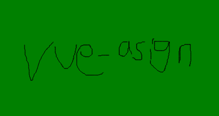

# vue-asign

 
> Canvas 生成电子签名


## 支持vue2、vue3

### [演示demo](https://laqtxy.gitee.io/vue-asign/)

## 功能

1. 适配 PC端 和 移动端
2. 自定义画布尺寸（导出图尺寸），画笔粗细、颜色，画布背景色；
3. 默认裁剪内容区域 ，可自定义周围边距或者设置不裁剪。
4. 导出图片格式为 `base64`；

## 安装

``` bash
npm install vue-asign --save
```

## 使用
1. 全局使用 、局部
```js
// 全局 vue2 main.js
import asign from 'vue-asign'
Vue.use(asign)

// 全局vue3 main.js
import App from './App.vue'
import asign from 'vue-asign'
const app = createApp(App)
app.use(asign)

// 局部
import asign from 'vue-asign'
components: {asign}
```

2. 说明

| 属性 | 类型 | 默认值 | 说明 |
| :-: | :-- | :-: | :-- |
| width | Number | 600 | 画布宽度，即导出图片的宽度 |
| height | Number | 300 | 画布高度，即导出图片的高度 |
| lineWidth | 4 | Number | 画笔粗细 |
| lineColor | String | #000000 | 画笔颜色 |
| gapLeft | Number | 5 | 图片左边距 |
| gapTop | Number | 5 | 图片上边距 |
| gapRight | Number | 5 | 图片右边距 |
| gapBottom | Number | 5 | 图片下边距 |
| direction | Number | 0 | 图片顺时针旋转角度（只有90、180、270三个数值有效） |
| bgColor | String | 空 | 画布背景色，默认为透明，<br />支持多种格式 '#aaa'，'#ababab'，'green'，'rgb(255, 255, 255)'，'rgba(255,255,255,0)' |
| isCrop | Boolean | true | 是否裁剪，在画布设定尺寸基础上裁掉四周空白部分 |
| format | String | image/png | 生成图片格式 image/jpeg(jpg格式下生成的图片透明背景会变黑色请慎用或指定背景色)、 image/webp |
| quality | Number | 1 | 生成图片质量；在指定图片格式为 image/jpeg 或 image/webp的情况下，可以从 0 到 1 的区间内选择图片的质量。如果超出取值范围，将会使用默认值 0.92。其他参数会被忽略。 |

注：isCrop为true时，图片宽高由实际内容决定。

3. 两个内置方法，通过给组件设置 `ref` 调用：
```js
<vueAsign ref="asign" :width="500" :height="300" :lineWidth="1" :lineColor="'red'" :bgColor="'green'" />
```
**清空画布**
```js
this.$refs.asign.clearCanvas()

```
**生成图片**
```js
this.$refs.asign.createImg().then(res=>{
        this.resImg = res
})

```

